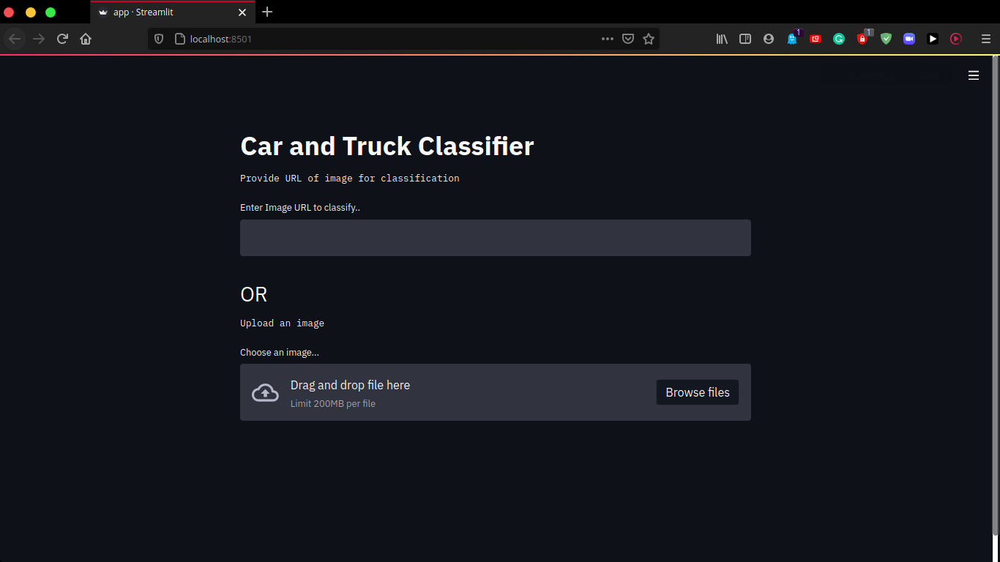

# Cars or Truck Classifier 🚗  🚚 <!-- omit in toc -->


## Contents 📰 <!-- omit in toc -->
- [Instructions to run 🏃](#instructions-to-run-)
- [How to use 👨‍🏫](#how-to-use-)
- [ML Model Details 💁](#ml-model-details-)
- [Requirements ⭐](#requirements-)

### Instructions to run 🏃

```bash
  streamlit run app.py
```

### How to use 👨‍🏫

Once you run the above code in the terminal. The streamlit app would start running in the localhost at a particular port which can be seen in the terminal output (A popout window in the browser of the webapp is usually obtained).


One can upload the image which needs to be classified in two ways.

1. Upload the image by URL


2. Upload Image from the PC


### ML Model Details 💁

Five different variations where tested. And the best among them is selected on the basis of accuracy of the test dataset.

Dataset Used : [Link](https://www.kaggle.com/enesumcu/car-and-truck)

Link to google collab with various models tried: [Link](https://colab.research.google.com/drive/1LlEAVqdxIWU5QURWvDnQHeX7Z7l7am6r?usp=sharing)

Link to google collab of the final model: [Link](https://colab.research.google.com/drive/1dZjJ18O1PbhPnE7aeB5XSVF5IKdzBIXr?usp=sharing)

### Requirements ⭐

```bash
opencv-python==4.5.1.48
Pillow==8.2.0
requests==2.25.1
streamlit==0.80.0
tensorboard==2.4.1
tensorflow==2.4.1
numpy==1.19.5

```